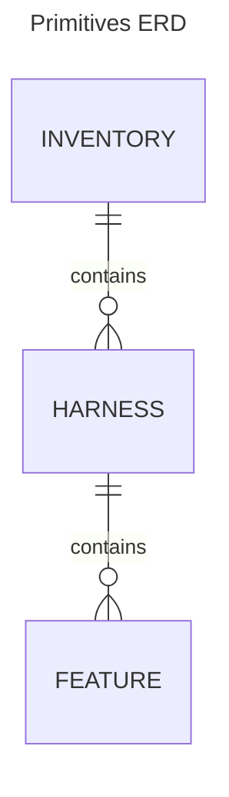

# `imagetest` Design

This doc outlines in more detail the user facing design of the provider, and
how that translates to the decisions made on the backend. It is not meant to be
a complete architectural design doc.

## Goals

The goal of the `imagetest` provider is to enhance the testability of the
images tests in [Chainguard Images](https://github.com/chainguard-dev/images).
It achieves this by breaking the testing suites into a handful of terraform
data/resource primitives, which under the hood, operate in ways that enhance
the testability of each image.

## Assumptions

At a high level, the current `images` terraform project is structured as follows:

- "globals": defined in `./main.tf`
- "images": defined in `./image/$image/main.tf`

The valid operating models of `Chainguard Images` is:

```bash
# the "mono" apply
terraform apply

# the image based targeted apply
terraform apply -target 'module.image'
```

The `imagetest` provider is designed to work under these existing assumptions.

## Primitives

The primitives are chosen to be simple to understand, and as intuitive as
possible to use given the current assumptions. They are as follows:

- `data.imagetest_inventory`
- `resource.imagetest_harness_*`
- `resource.imagetest_feature`

These primitives depend on each other with the following relationship:



A `harness` defines the ephemeral testing harness used to execute the features
against, and generally can be anything. These range from things like ephemeral
containers, to cloud resources like `eks` clusters. These are defined as
reusable `resources` that all have their own configuration schema.

A `feature` depends on a given `harness`, and depending on the `harness`, will
execute in different ways. For example, feature steps with a `container`
harness will operate on the container, while `feature` steps on a `k3s` harness
will execute in a connected sandbox container with an attached network to an
ephemeral k3s cluster.

### `inventory`

The inventory is the "hack" that makes this whole thing work. Since the current
`images` project relies on a _single_ `terraform apply`, we need to model the
creation _and_ deletion of testing harnesses within a single `terraform apply`,
which executes both the `plan` and `apply` operations in sequence.

The most effective way to do this is to keep a running `inventory` of all the
available features mapped to their harnesses, so we know a) when to create a
harness, and b) when to destroy the harness.

Within terraform's operating model, this is impossible to safely do without
having a known quantity of harnesses and features. So to work around this
limitation, we manage this through a `data.imagetest_inventory`, which lets us
take inventory during the `plan` phase, and use it during the `apply` phase to
lookup known quantities.

### harness

The `harness` are resources that allow the user to easily create different
ephemeral testing harnesses. Under the hood, they can be created by whatever
means necessary, but are generally exposed with sane defaults and minimal
configuration.

A `harness.name` must be unique within the provided `inventory`, since the
`inventory` serves as a lookup between the different `plan` and `apply` phases.

Each `harness` has its own operating model for how `features` are executed.
This is also what makes test authoring simpler. For example, a `feature` that
depends on a `k3s` harness expects the steps to run on a preconfigured cluster.
This way, `features` don't need to handle their own `kubeconfig` setup, and can
simply rely on the provider for ensuring a consistent test harness setup.

Since some `harnesess` are expensive to spin up, the provider also supports the
idea of "feature filtering", which restrict the execution of certain features
depending on apply time input. Using the `inventory`, we can gleam which
features a harness depends on during the `harness.Create()` method, and
determine whether we should skip the creation of the harness or not.

### feature

Finally, `features` are most similar to the current `oci_exec_test` data source
on the `oci` provider. The difference here is they run against the desired
harness. While a small UX difference, the backend implementation is huge.

This allows testing steps to be authored against reusable ephemeral
environments, and removes the limitation the current `images` project has on
host level resources (ie the shared `k3s` cluster).
